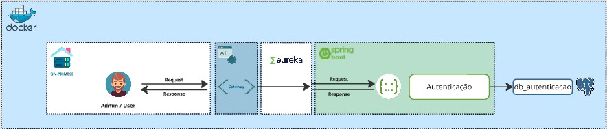

## Sistema de Autenticação

### Descrição
Este sistema proporciona um mecanismo robusto e seguro para autenticação de usuários, permitindo o acesso controlado a recursos da aplicação. Utilizando tecnologias modernas como Spring Boot e JWT, o sistema garante a confidencialidade e integridade das informações do usuário.

### Arquitetura
O sistema está estruturado em microserviços, utilizando Spring Boot como framework principal. A arquitetura se baseia nos seguintes componentes:

* **API:** Ponto de entrada para as requisições de autenticação, oferecendo endpoints para login, registro e outras operações relacionadas a usuários.
* **Serviço de Autenticação:** Responsável por validar as credenciais do usuário, gerar tokens JWT e gerenciar as interações com o banco de dados.
* **Banco de Dados:** Armazena as informações dos usuários, como login, senha, roles e outras informações relevantes.
* **Eureka Server:** Serviço de registro e descoberta de serviços, facilitando a comunicação entre os microserviços.

[Insira um diagrama UML ou de sequência para ilustrar a arquitetura, se possível]

### Tecnologias Utilizadas
* **Spring Boot:** Framework Java para desenvolvimento de aplicações web.
* **Spring Security:** Framework para segurança de aplicações Java, utilizado para proteger os endpoints da API.
* **JWT:** JSON Web Tokens para autenticação, garantindo a segurança e a portabilidade dos tokens.
* **PostgreSQL:** Banco de dados relacional para armazenar as informações dos usuários.
* **Eureka Server:** Serviço de descoberta de serviços para facilitar a comunicação entre os microserviços.

### Fluxo de Trabalho
1. **Solicitação de Autenticação:** O cliente envia uma requisição para o endpoint `/login` da API, fornecendo as credenciais de login.
2. **Validação das Credenciais:** O serviço de autenticação valida as credenciais do usuário contra o banco de dados.
3. **Geração de Token:** Caso as credenciais sejam válidas, um token JWT é gerado e retornado para o cliente.
4. **Autenticação Subsequente:** Em requisições posteriores, o cliente inclui o token JWT no cabeçalho da requisição para provar sua identidade.

### Instalação
1. **Clone o repositório:**
   ```bash
   git clone https://github.com/HACKATON-FIAP/hackaton-autenticacao-app

   